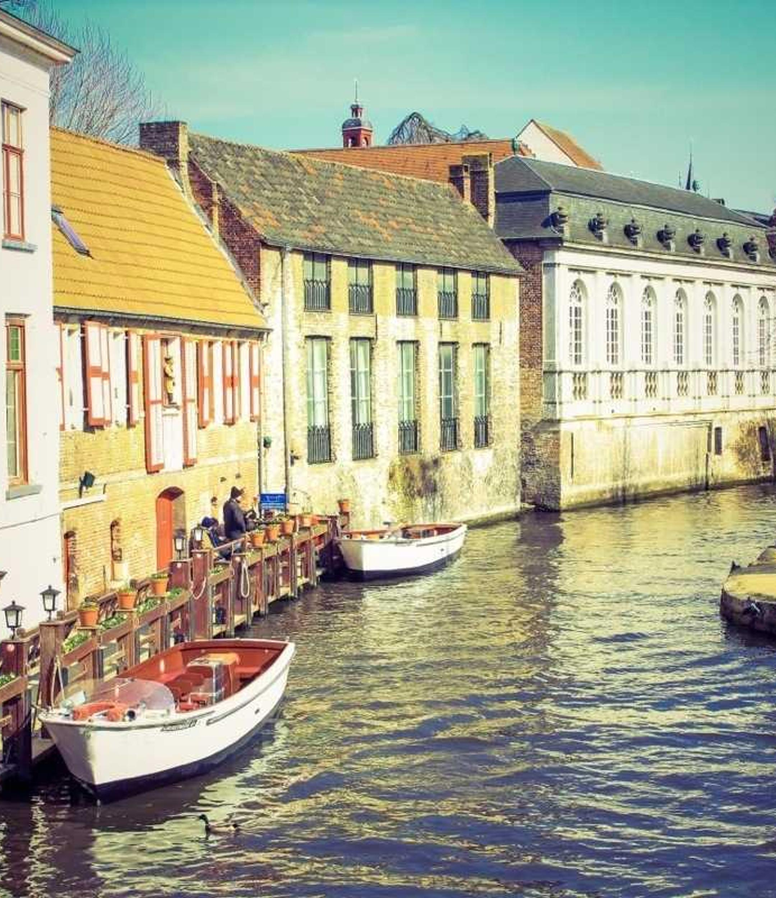
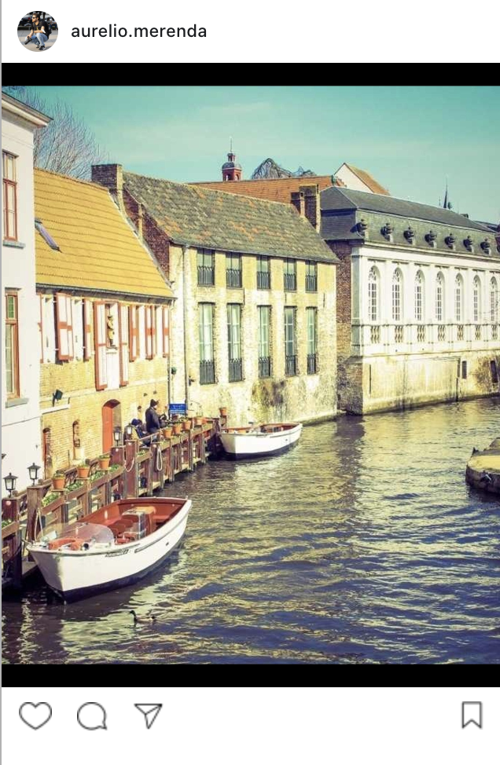

# Instagram Image Resizer

Resize and optimise images for Instagram post sizes.

This library can take a single image path or a folder containing multiple images and create images ready to be publish as Instagram posts.

## Examples

<table>
  <tr>
    <th>TYPE</th>
    <th>SOURCE IMAGE</th>
    <th>OUTPUT IMAGES</th>
    <th>INSTAGRAM POST</th>
  </tr>
  <tr>
    <td>Horizontal<br/>Image</td>
    <td>
      
    </td>
    <td>
      <br />
      <br />
      
    </td>
    <td>
      
    </td>
  </tr>
  <tr>
    <td>Square<br/>Image</td>
    <td>
      
    </td>
    <td>
      
    </td>
    <td>
      
    </td>
  </tr>
  <tr>
    <td>Vertical<br/>Image</td>
    <td>
      
    </td>
    <td>
      
    </td>
    <td>
      
    </td>
  </tr>
</table>

## How it works

### Resize a single image

To resize a single image `src/image.jpg` and save new images in the folder `output`, you can use it from the command line:

```bash
# npx instagram-image-resizer (sourceImagePath) (destinationPath)
npx instagram-image-resizer src/image.jpg output
```

or in your code:

```bash
npm install instagram-image-resizer
```

```javascript
import resizer from "instagram-image-resizer";

// resizer(sourceImagePath, destinationPath)
const destinationFilesPaths = await resizer("src/image.jpg", "output");

// destinationFilesPaths will be an array containing the new file/files' paths
```

For example, for the horizontal image `src/image.jpg`, it will create 3 new images: `output/image-1.jpg`, `output/image-2.jpg`, `output/image-3.jpg`.

### Resize a folder containing multiple images

To resize multiple images contained in a folder `src`, and save new images in the folder `output`, you can use it from the command line:

```bash
# npx instagram-image-resizer (sourceImagesFolderPath) (destinationPath)
npx instagram-image-resizer src output
```

or in your code:

```bash
npm install instagram-image-resizer
```

```javascript
import resizer from "instagram-image-resizer";

// resizer(sourceImagePath, destinationPath)
const destinationFilesPaths = await resizer("src", "output");

// destinationFilesPaths will be an array containing the new files' paths
```

For example, if the source folder `src` will contain 2 vertical images `src/cat.jpg` and `src/dog.jpg`, it will create 2 new images: `output/cat-1.jpg`, `output/dog-1.jpg`.

## Contribute

Do you want to contribute to this library? Read its [CONTRIBUTE file](./CONTRIBUTE.md).

## Thanks

Thanks to:
- [Lorem Picsum](https://picsum.photos/) to have used their images for examples;
- [Best Lightroom export settings for Instagram in 2023](https://shotkit.com/lightroom-export-instagram/) article;
- [The best export settings for Instagram 2021](https://patkay.com/blogs/pk/instagram-export-settings-lightroom) article;

## Next Steps

- Add logs for the CLI usage;
- resize images for Instagram Stories.