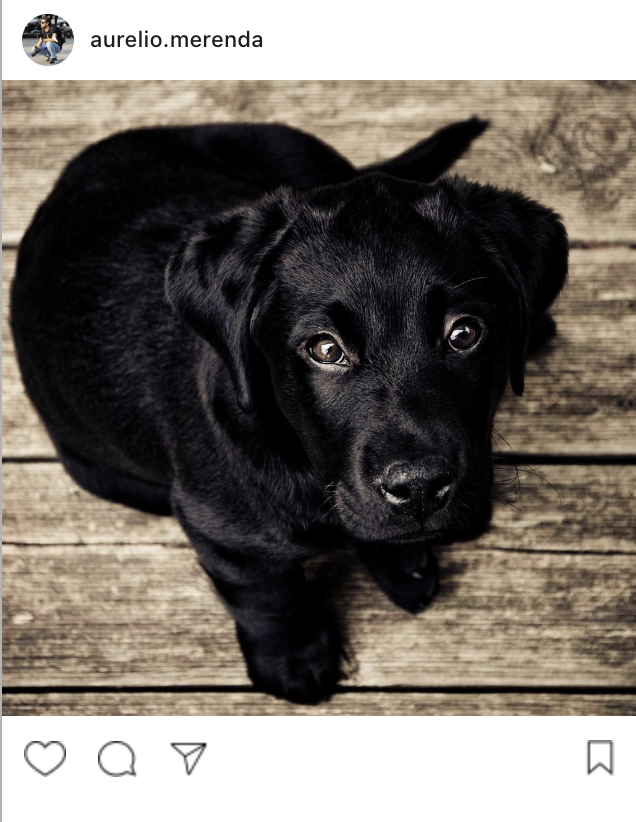

# Instagram Image Resizer

Resize and optimise images for Instagram post sizes.

This library can take a single image path or a folder containing multiple images and create images ready to be publish as Instagram posts.

## Example

<table>
  <tr>
    <th>TYPE</th>
    <th>SOURCE IMAGE</th>
    <th>OUTPUT IMAGES</th>
    <th>INSTAGRAM POST</th>
  </tr>
  <tr>
    <td>Horizontal Image</td>
    <td>
      
    </td>
    <td>
       
       
      
    </td>
    <td>
      
    </td>
  </tr>
  <tr>
    <td>Square Image</td>
    <td>
      
    </td>
    <td>
      
    </td>
    <td>
      
    </td>
  </tr>
  <tr>
    <td>Vertical Image</td>
    <td>
      
    </td>
    <td>
      
    </td>
    <td>
      
    </td>
  </tr>
</table>

## TO DO

- [x] add commitlint
- [x] add husky to run commitlint
- [x] add .nvmrc
- [x] add lint + prettier
- [x] run lint on commit
- [x] integration tests
- [ ] write documentation
- [ ] write CONTRIBUTE documentation
- [ ] setup versioning
- [ ] setup pipeline
- [ ] publish first version